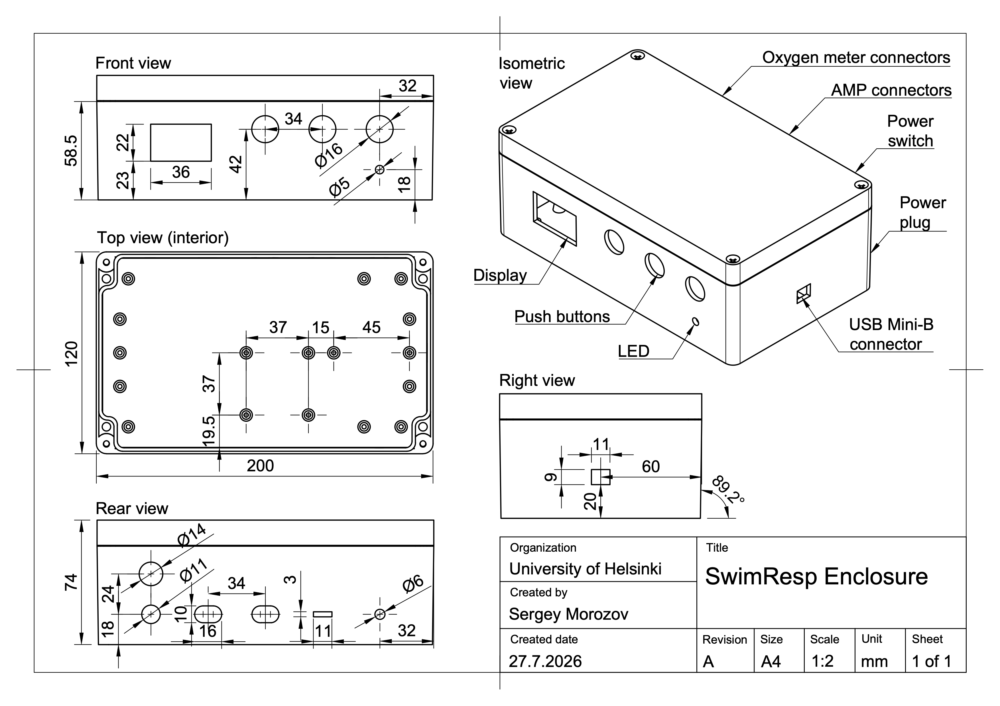
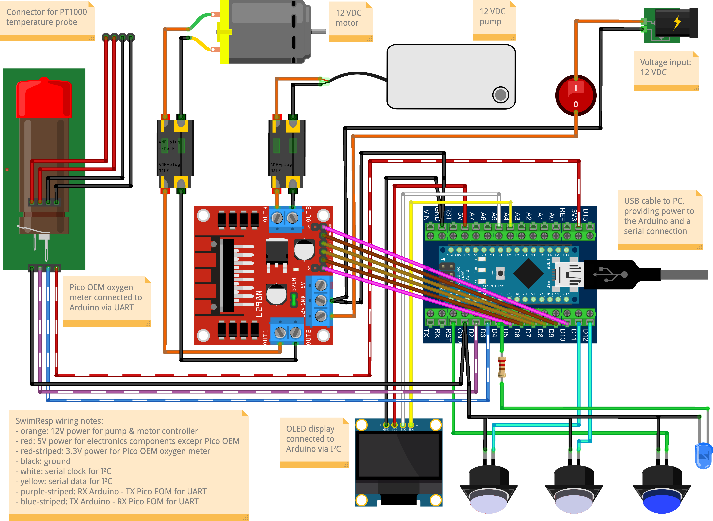

# SwimResp Build Guide
**Revision:** 0.3
**Author:** Sergey Morozov  
**Date:** 2 August 2026

<!-- begin-md-image -->

<!-- end-md-image -->

# Table of Contents

1. [Introduction](#1-introduction)
2. [Safety Notes](#2-safety-notes)  
   2.1 [Environmental Safety](#21-environmental-safety)  
   2.2 [Electrical Safety](#22-electrical-safety)  
   2.3 [Mechanical and Tool Safety](#23-mechanical-and-tool-safety)
3. [Bill of Materials](#3-bill-of-materials)
4. [Tools and Consumables](#4-tools-and-consumables)
5. [Assembly Instructions](#5-assembly-instructions)  
   5.1 [Preparing the enclosure](#51-preparing-the-enclosure)  
   5.2 [Installing power distribution components](#52-installing-power-distribution-components)  
   5.3 [Installing and wiring the controller](#53-installing-and-wiring-the-controller)  
   5.4 [Adding the user interface components](#54-adding-the-user-interface-components)  
   5.5 [Connecting the DO and temperature logger](#55-connecting-the-do-and-temperature-logger)  
   5.6 [Finalizing the enclosure](#56-finalizing-the-enclosure)

---

# 1. Introduction

SwimResp is an open‑source device for controlling a 12 V DC pump and motor used in a DIY swim tunnel. It controls water‑flow speed inside the swim tunnel, refreshes water via a pump, and displays operational data on a local screen. The device is designed to interface with the dissolved‑oxygen meter Pico‑O2‑OEM, enabling threshold‑based pump activation in addition to simple time‑based control. All dissolved‑oxygen and temperature data fetched from the Pico‑O2‑OEM are transmitted to a PC for real‑time visualization together with water‑flow speed and pump‑phase information.

This guide explains how to assemble the hardware step by step. It covers preparing the enclosure, wiring the electronics, installing the user‑interface components, and loading the software. The document focuses strictly on construction and verification; experimental applications and biological context are described separately in the accompanying manuscript.

**User skill level.** The build guide is intended for students, technicians, and researchers with basic technical skills. No engineering background is required. Users should be comfortable with simple soldering and basic multimeter measurements (continuity and DC voltage).

**Assembly environment.** SwimResp can be assembled in any standard workspace equipped for basic electronics and mechanical tasks, including university or biological‑station workshops, applied‑sciences laboratories, or local FabLabs (a global directory is provided by the Fab Foundation). The enclosure can be purchased and modified or fabricated using a 3D printer.

**Estimated build time.** Assembly, software setup, and full functional verification typically require 1–2 days for a first‑time build depending on user skills. When assembling multiple identical units, the per‑device time decreases substantially as enclosure preparation and wiring become more routine.

## Versioning

This guide corresponds to SwimResp hardware, software, and documentation release **v1.0.0**.

Source files and updates are available in the public repository:  
<https://github.com/embedded-sergey/SwimResp>

## Licensing

- **Software:** GPL‑3.0  
- **Hardware designs:** CERN-OHL-S v2 
- **Documentation (including this guide):** CC‑BY‑4.0  

These licenses ensure open access, modifiability, and reproducibility across all components of the SwimResp platform. If this guide contains hardware diagrams or code snippets, those components are licensed under their respective hardware or software licenses.

# 2. Safety Notes

## 2.1 Environmental Safety

SwimResp is designed to be water-resistant, providing protection against accidental splashes and operation in high humidity environments. To reduce moisture accumulation in humid environment, place an absorbent pack inside the enclosure. SwimResp is not waterproof: if the device is submerged or dropped into the water, immediately power it off, disconnect the USB cable and do not resume operation until the enclosure and internal components have been thoroughly inspected and dried.

## 2.2 Electrical Safety

SwimResp operates at 5-12 VDC, which falls within the extra-low-voltage category recognized in electrical safety standards worldwide. Devices operating at ≤ 24 VDC are generally considered safe for personal, educational, and research use, and in most countries can be built and used without electrical certification, provided that a certified external power supply is used and no mains‑voltage wiring is modified. 

The power supply unit must include integrated overcurrent protection (fuse or electronic limit) and should be selected based on the total power requirements of the connected pump and motor. For example, if a pump and a motor draw 0.6 A each at 12 V, the total current is 1.2 A. In this case, a 12 V, 2 A power supply provides sufficient overhead for safe operation (i.e., operating below ~70% of the power supply unit's maximum rated output). The minimum recommended wire size for regular 5-12V is 24 AWG and 20 AWG for high‑current pump circuits.

During assembly and testing, follow basic electrical‑safety practices. Keep the device disconnected from any power source while you work. Check the polarity of every wire before connecting power, and avoid any contact between the positive and negative lines. Before turning the device on, inspect all solder joints, connectors, and insulation to make sure nothing is loose or exposed. Use a multimeter to check your wiring: confirm that each connection has continuity and make sure there are no accidental shorts. Switch the device on only when you’re sure all connections are correct.

## 2.3 Mechanical and Tool Safety

Use adhesive materials, mechanical and electrical tools listed in the section "Tools and Consumables” with care. If you are inexperienced with some of them, seek assistance from a trained technician. Wear personal protection equipment: protective glasses and fume mask, especially when soldering and use heat‑resistant mat to protect your workspace. During the assembly process run the tests referred in the assembly instructions to make the assembly process to be safe and verify the quality of SwimResp.

# 3. Bill of Materials

Price estimates for generic components use Amazon.com  as a reference, based on pricing available in August 2026. Amazon is chosen because it provides broad international availability, relatively stable pricing, and consistent product listings, which makes it a practical baseline for reproducible cost estimates. Because many components on Amazon are sold only in bulk packs, the bill of materials lists the price of the entire pack even when only one piece is needed, which inflates the apparent cost of a single device and results in unnecessary surplus. In practice, individual components can often be purchased at lower cost from suppliers that support small‑quantity or single‑unit purchasing, including local electronics stores, online marketplaces, and global engineering distributors such as Mouser or Digi‑Key. Prices for specialized sensors and measurement devices are taken directly from manufacturers’ websites when these items are not consistently available through the above distributors.

Prices listed in this BOM exclude VAT, customs duties, and delivery costs.

| Part Name | Manufacturer | Quantity | Unit Price (USD)¹ | Total Price (USD) | Notes |
|-----------|--------------|----------|--------------------|--------------------|-------|
| Industrial ABS enclosure, IP65, 200×120×75 mm | Generic | 1 pc | 10 | 10 | – |
| Male waterproof automotive connectors (Superseal 1.5‑style), 2‑pin | Generic | 2 male–female pairs | 8 | 8 | Bulk pack (3–5 pairs). Female connectors are also needed for a pump and a motor connected to SwimResp²|
| L298N motor driver board | Generic | 1 pc | 5 |  5 | Supports one pump and one motor at up to ~1.5 A per channel (2 A peak) at 12 V. |
| Red and black wires, 20 AWG | Generic | 1 m each | 3 | 3 | Use 16 AWG for high‑current pumps and motors |
| Round rocker switch, mounting hole diameter 15 mm, 2-pin | Generic | 1 pc | 6 | 6 | Bulk pack (3–5 pcs) |
| DC power jack, steel, 5.5×2.1 mm | Generic | 1 pc | 7 | 7 | Bulk pack (3–5 pcs) |
| Arduino Nano–compatible board (ATmega328P) with Mini-B USB cable and screw‑terminal adapter | Generic | 1 kit | 9 | 9 | The board can be replaced by the Arduino Nano rev.3 or 3.3 V-board from Nano family |
| Push button, mounting hole diameter 16 mm, 2-pin | Generic | 3 pcs | 10 | 10 | Bulk pack (10-24 pcs) |
| LED, 5 mm | Generic | 1 pc | 6 | 6 | Bulk pack (50–200 pcs) |
| Resistor, 220 Ω, ¼ W | Generic | 1 pc | 6 | 6 | Bulk pack (20–200 pcs) |
| OLED 128x64 I²C monochrome display, 5 V | Generic | 1 pc | 9 | 9 | – |
| Solderless breadboard BB170, 47x35x8.5 mm | Generic | 1 pc | 6 | 6 | Bulk pack (3–6 pcs) |
| Female to male jumper wires, square jumpers, 10 cm | Generic | 1 kit | 5 | 5 | – |
| M3 Hex spacers standoff kit | Generic | 1 kit | 12 | 12 | To attach terminal and motor driver boards to enclosure |   
| Optical oxygen meter Pico‑02 OEM module, UART, 3.3–5 V | PyroScience | 1 pc | NA³ | NA³ | Compatible with optical REDFLASH oxygen sensors and PT1000 |

**Grand total: 102 USD excluding price for Pico oxygen meter**.³

*¹ Unit prices reflect the smallest purchasable quantity on Amazon.com. When only bulk packs are available, the listed price corresponds to the full pack even if a single piece is required.*

*² This BOM does not include pumps or their cables.*

*³ Price available only via manufacturer quotation.*

# 4. Tools and Consumables
These items are not included in the BOM because they are general workshop supplies rather than project‑specific components, but they are still required for assembly. Most of the tools and consumables can be found in FabLabs, electronic/robotics clubs and Universities of Applied Sciences around the world.

Mechanical tools:
* utility cutter
* long-nose pliers
* wire cutters
* screwdriver
* drill with step drill bit
* rotary tool with 1 mm drill bit and cut‑off wheel

Electrical tools and materials:
* soldering iron
* solder wire
* flux
* heat-shrink tubing

Adhesives:
* hot-glue gun
* hot-glue sticks
* superglue
* silicone tape

Measuring and marking tools:
* multimeter
* ruler
* pencil

Safety tools:
* protective glasses
* fume mask
* heat-resistant mat

# 5. Assembly Instructions
This section contains 40 assembly steps covering mechanical preparation, wiring, and installation of all the components. Before beginning the assembly, note that several steps in Sections 5 and 6 have corresponding functional checks in Section 7. These checks can be performed immediately after completing each relevant assembly step or after the full assembly is finished. Performing the checks in parallel with assembly helps identify wiring mistakes early and reduces the risk of component damage.

## 5.1 Preparing the enclosure
SwimResp can be assembled using either a commercially available enclosure or the provided 3D‑printed enclosure. The printed version already includes all openings for the switch, power jack, and display, so drilling and cutting are not required (Steps 2–7). STL files are available in the SwimResp repository.

**Step 1.** Unscrew the cover to open the enclosure.

**Step 2.** Mark the hole positions on the base and on the cover of the enclosure using a ruler and a pencil, following the dimensions shown in Figure 1.

Figure 1. Blueprint of the SwimResp enclosure  

**Step 3.** If you use components with different form factors or an enclosure with different dimensions, adjust the blueprint. Alternatively, mark the hole positions directly on the enclosure if dimensions differ.

**Step 4.** Drill the holes at the marked positions, then refine their shape using a utility cutter if needed.

**Step 5.** Cut the recess for the OLED display using either a utility cutter guided along a ruler or a rotary tool with a cut‑off wheel.

**Step 6.** For oval‑shaped holes on the rear panel, drill two overlapping holes and shape the opening with a cutter or a rotary tool, including the top recess.

**Step 7.** Place five M3 hex standoffs at the positions shown in the top interior view of Figure 1 and temporarily position the screw terminal adapter and the L298N motor driver board against them to verify alignment. Once correct alignment is confirmed, glue the M3 hex standoffs to the enclosure at the identified positions using superglue.

**Step 8.** Remove the two protrusions on the bottom side of each body of a male waterproof connector using a utility cutter or a rotary tool with a cut‑off wheel.

**Step 9.** Assemble one male waterproof connector with 15 cm wires and the other one with 5 cm wires. Ensure that the red wire is inserted into port 1 of the connector and the black wire into port 2, respectively. Incorrect color order can lead to wiring errors.

**Step 10.** Insert the male waterproof connector with 15 cm wires into the oval‑shaped hole in the middle of the rear panel, and insert the second connector into the remaining oval‑shaped hole. Secure both connectors to the enclosure wall using a hot‑glue gun.

## 5.2 Installing power distribution components
**Step 11.** Mount the L298N motor driver board onto the standoffs on the bottom panel of the enclosure and screw it in place.

**Step 12.** Connect the wires from the middle male waterproof connector to OUT1 and OUT2, and the wires from the second waterproof connector to OUT3 and OUT4 of the L298N motor driver board, respectively, as shown in Figure 2.

Figure 2. Wiring scheme of the SwimResp

**Step 13.** Mount the rocker power switch and the power connector to the rear panel of the enclosure.

**Step 14.** Solder the shortest red wire (shown in Figure 3) to the power pin of the power connector and the lower pin of the power switch.

**Step 15.** Solder the 15 cm black wire (shown in Figure 3) to the ground pin of the power connector and insulate the joint with heat‑shrink tubing. Attach the other end of this wire to the terminal block leading to the GND pin of the L298N motor driver board (see Figure 2).

**Step 16.** Solder the 15 cm red wire (shown in Figure 3) to the upper pin of the power switch. Attach the other end of this wire to the terminal block leading to the 12 V pin of the L298N motor driver board (see Figure 2).

## 5.3 Installing and wiring the controller
**Step 17.** Prepare the wire jumpers and wires needed for the device assembly, as shown in Figure 3, using wire cutters.

**Step 18.** Mount the Arduino Nano screw‑terminal adapter onto the standoffs on the bottom panel of the enclosure and screw it in place. Ensure that the D12 and D13 labels are oriented towards the USB opening on the side panel. For cleaner wire organisation, route the red and black power wires behind the adapter.

**Step 19.** Install the Arduino Nano–compatible board (ATmega328P) into the screw‑terminal adapter. Check that the Arduino Nano’s D12 pin aligns with the adapter’s D12 terminal.

**Step 20.** Connect six jumper wires to the L298N motor driver board (ENA, IN1, IN2, IN3, IN4, ENB) and secure the free wire ends in the screw‑terminal adapter (the pins D5-D10, respectively) as shown in Figure 2.

## 5.4 Adding the user interface components
**Step 21.** Solder the LED together with the 220 Ω resistor and the wires as shown in Figure 3. Ensure correct LED polarity (long leg is typically +).

**Step 22.** Mount the LED into the corresponding opening on the front panel of the enclosure using a hot‑glue gun.

**Step 23.** Connect the LED’s wire with the resistor to the D4 pin of the screw‑terminal adapter as shown in Figure 2.

**Step 24.** Install three push buttons on the front panel using their mounting nuts.

**Step 25.** Solder black ground wires in a daisy‑chain manner from the LED to each push button, and connect the last one to the GND pin of the screw‑terminal adapter (Figure 2).

**Step 26.** Solder the green wires from each button to the corresponding pins of the screw‑terminal adapter shown in Figure 2 (see [Check 5](#check-5-no-wiring-faults-in-the-lowvoltage-control-circuit)).

**Step 27.** Secure the OLED display with hot glue around its edges on both sides of the enclosure (Figure 1). Apply glue only to PCB edges, not the glass.

**Step 28.** Connect the OLED display to the corresponding pins of the screw‑terminal adapter using 20 cm wire jumpers, as shown in Figure 2 and Figure 5.

Figure 5. Final assembly photo.

Ensure to twist the I²C wires (data and clock) together whenever routing I²C lines inside the enclosure (Figure 5).

## 5.5 Connecting the DO and temperature logger
**Step 29.** Prepare four 10 cm female jumper wires using wire cutters as shown in Figure 3. Glue the jumper heads together to form a four‑pin female connector, so they remain aligned when inserted into the enclosure.

**Step 30.** Insert the connector into the rectangular opening and secure it to the enclosure wall using a hot‑glue gun (Figure 1, Figure 2).

**Step 31.** Solder the other wire ends to the solder pads for the external temperature sensor on the Pico-O2 logger as shown in Figure 2. Use minimal solder to avoid bridging pads.

**Step 32.** Mount the Pico-O2 logger to the rear panel of the enclosure (Figure 5).

**Step 33.** Insert 20 cm wires into the Connector X1 of the Pico‑O2 logger, as shown in Figure 2. Note that the embedded LED is located above the Connector X1 for the correct orientation.

**Step 34.** Connect the other wire ends to the corresponding pins of the screw‑terminal adapter (Figure 2).

**Step 35.** Optionally, glue the solderless breadboard to the bottom part of the enclosure between the Pico‑O2 logger and the L298N motor driver board. This breadboard can be used for integrating new components (SwimResp modifications or enhancements).

## 5.5 Finalizing the enclosure
**Step 36.** Insert the provided insulating material into the enclosure groove to prevent water contact between the environment and internal wiring.

**Step 37.** Fabricate a water-resistant layer that is attached to the USB cable connected to the Arduino Nano–compatible board (ATmega328P). This must fit the opening on the cover of the enclosure and can be made from silicone tape or another flexible waterproof material.

**Step 38.** Fabricate an additional water‑resistant lid to seal the opening during storage or when the USB cable is removed.

**Step 39.** Screw the cover securely to the base using the original mounting screws.

**Step 40.** Ensure the cover is seated evenly and that no wires are pinched when closing the enclosure.
